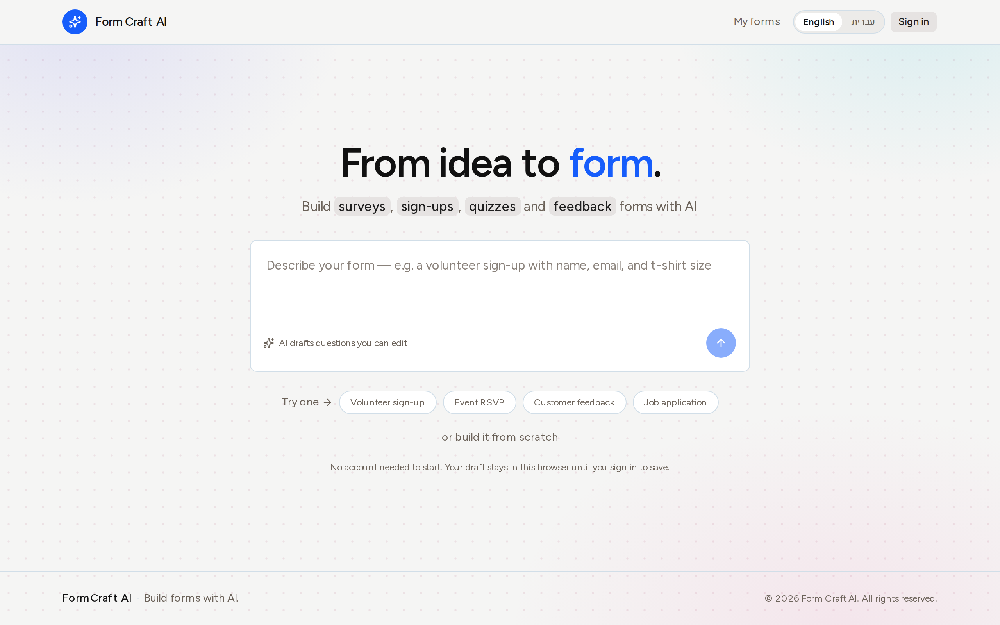

<div align="center">

# Form Craft AI

From an idea to a shareable form. AI writes the first draft, you edit it.

**[Live demo](https://form-craft-ai.yanivv77.workers.dev)**



</div>

## What it does

- Describe a form in plain language and get editable questions from Gemini.
- Build anonymously in the browser. You sign in only when you save.
- Share a public link and collect responses from anyone.
- Export responses to CSV.
- Works in English and Hebrew (right to left).

## Built with

Next.js 16 on Cloudflare Workers (OpenNext), Neon Postgres with Drizzle, Better
Auth (Google), Gemini Flash-Lite, Tailwind v4, and next-intl.

## Run locally

```bash
pnpm install
cp .dev.vars.example .dev.vars   # fill in the keys (see Setup below)
pnpm dev                         # http://localhost:3000
```

Before shipping, check it on the real runtime with `pnpm preview` (workerd, on
http://localhost:8787). Other commands: `pnpm typecheck`, `pnpm lint`, and
`pnpm test:e2e:isolated` (the e2e suite on a throwaway database).

<details>
<summary><b>Setup: environment keys</b></summary>

<br>

Copy the example and fill it in. `.dev.vars` is gitignored, so real values stay
local.

```bash
cp .dev.vars.example .dev.vars
```

| Key | Where it comes from |
|---|---|
| `DATABASE_URL` | Neon pooled connection string ([neon.tech](https://neon.tech)). Apply the schema with `pnpm db:migrate`. |
| `BETTER_AUTH_SECRET` | `openssl rand -base64 32` |
| `BETTER_AUTH_URL` | `http://localhost:3000` locally, the deployed origin in production |
| `GOOGLE_CLIENT_ID` / `GOOGLE_CLIENT_SECRET` | Google OAuth web client. Add `<origin>/api/auth/callback/google` as a redirect URI. |
| `GEMINI_API_KEY` | [aistudio.google.com/apikey](https://aistudio.google.com/apikey) |
| `GEMINI_MODEL` | `gemini-2.5-flash-lite` |
| `E2E_TEST_MODE` | `false` (keeps the test-only routes off) |

The app reads these per request through `getEnv()` in `lib/cf.ts`. Never read env
at module scope: that crashes on Workers.

</details>

<details>
<summary><b>Deploy to Cloudflare</b></summary>

<br>

```bash
pnpm wrangler login
pnpm deploy                         # creates the Worker and prints the URL
```

Then set the same keys as encrypted secrets, one per command, and keep
`E2E_TEST_MODE` set to `false`:

```bash
pnpm wrangler secret put DATABASE_URL
pnpm wrangler secret put BETTER_AUTH_SECRET
pnpm wrangler secret put BETTER_AUTH_URL
pnpm wrangler secret put GOOGLE_CLIENT_ID
pnpm wrangler secret put GOOGLE_CLIENT_SECRET
pnpm wrangler secret put GEMINI_API_KEY
pnpm wrangler secret put GEMINI_MODEL
pnpm wrangler secret put E2E_TEST_MODE
```

Set `BETTER_AUTH_URL` to the deployed origin, add
`<origin>/api/auth/callback/google` to the Google OAuth redirect URIs, and run
`pnpm db:migrate` against the production database. If the URL shows a Cloudflare
Access login, remove the matching app under Zero Trust, Access, Applications.

</details>

## More

Architecture, the Cloudflare runtime rules, and the decisions log are in
[AGENTS.md](./AGENTS.md). The AI endpoint has built-in rate limits, caching, and a
daily budget cap, described there too.

Regenerate the screenshot with `node scripts/screenshot.mjs`.

Built by [Yaniv](https://github.com/Yanivv77).
